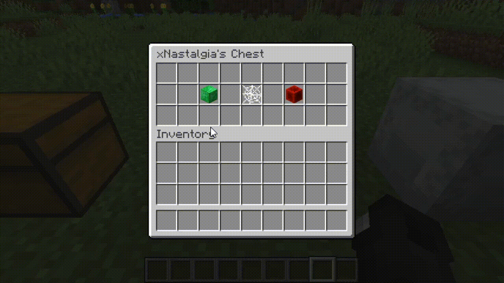
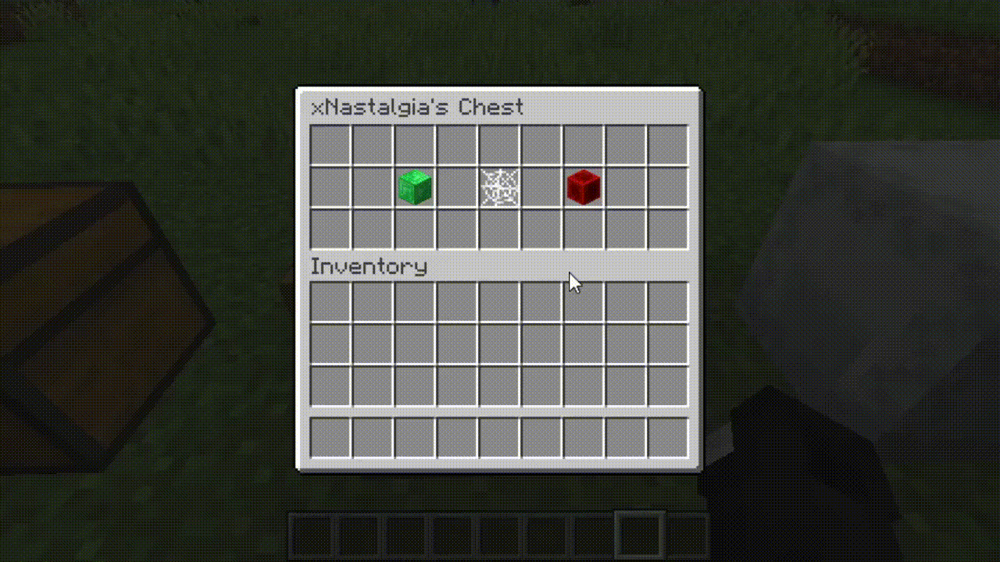
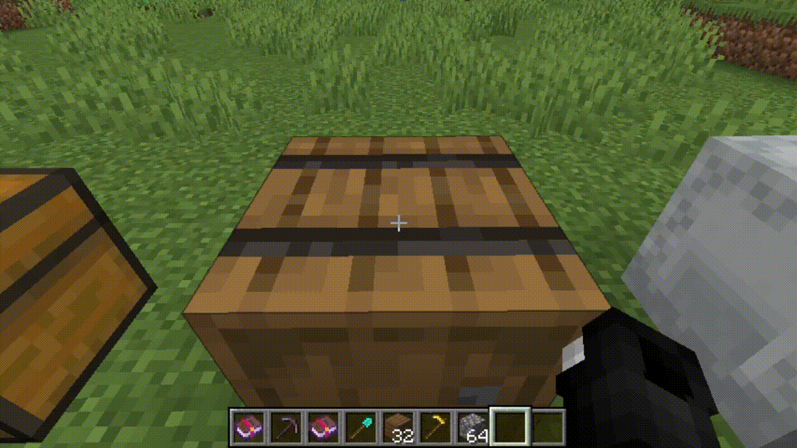

# StorageDepth
StorageDepth is a simple plugin that gives more "depth" to storage blocks.

## 🌎 Useful Links
[Spigot - Download Here!](https://www.spigotmc.org/resources/storagedepth.93520/)

## What it offers
* Add and remove player access to a certain storage block.
* Check a history of changes of the storage block.

## Commands
* `/storage` - Opens up the storage prompt.
* `/storage add {player_name_here}` - Add player access to storage block.
* `/storage remove {player_name_here}` - Remove player access to storage block.

## Current Status
* Supports Chests, Barrels, and Shulker Boxes.

## Future Plans
* Add support for other storage blocks.

## UI
### Add Players

### Remove Players

### Browse History

